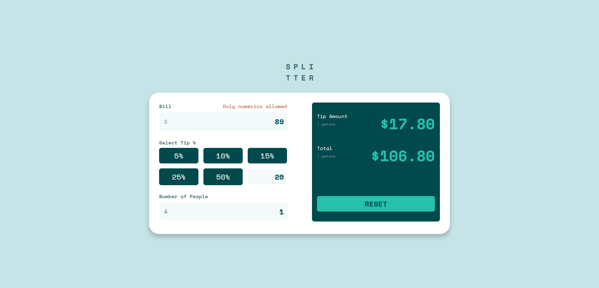
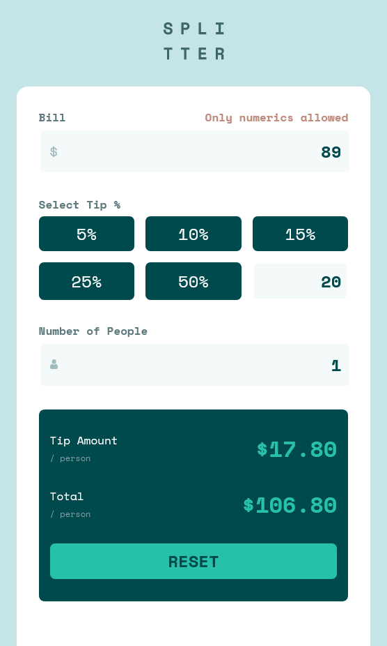

# Frontend Mentor - Tip calculator app solution

This is a solution to the [Tip calculator app challenge on Frontend Mentor](https://www.frontendmentor.io/challenges/tip-calculator-app-ugJNGbJUX). Frontend Mentor challenges help you improve your coding skills by building realistic projects.

## Table of contents

- [Overview](#overview)
  - [The challenge](#the-challenge)
  - [Screenshot](#screenshot)
  - [Links](#links)
- [My process](#my-process)
  - [Built with](#built-with)
- [Author](#author)
- [Acknowledgments](#acknowledgments)

## Overview
Tip calculator app challenge on Frontend Mentor](https://www.frontendmentor.io/challenges/tip-calculator-app-ugJNGbJUX)

### The challenge

Users should be able to:

- View the optimal layout for the app depending on their device's screen size
- See hover states for all interactive elements on the page
- Calculate the correct tip and total cost of the bill per person

### Screenshot

### Links

- Solution URL: https://github.com/ajay0024/tip-calculator
- Live Site URL: https://ajay0024.github.io/tip-calculator/

## My process
I build with mobile first workflow. Grid layout has been used in conjunction with  flex . Javascipt has been used for all the calculations and validation.

### Built with

- Semantic HTML5 markup
- CSS custom properties
- Grid Layout
- Flexbox
- Mobile-first workflow
- JavaScript

## Author

- Website - https://ajay0024.github.io/cv/
- Frontend Mentor - https://www.frontendmentor.io/profile/ajay0024
- Twitter - https://twitter.com/Python72000166

## Acknowledgments

This was inspirational. Will do more.
